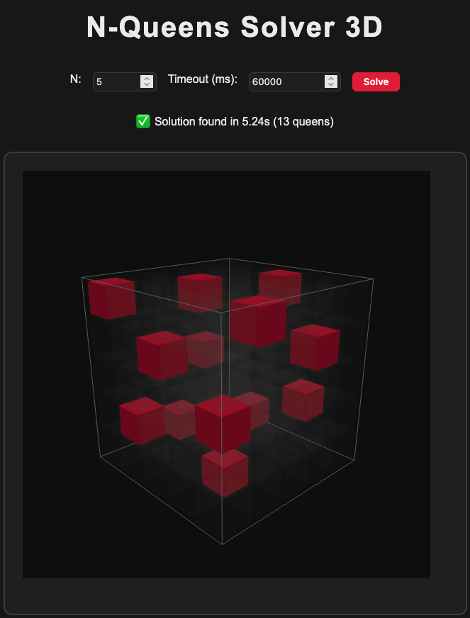

<div align=center>
  
   # 3D Queen Problem Solver <br>
  
  
  
  
  <br><br>
  
  
  
  
  
  <br><br>
  
</div>

## Description

N_Queen_3D is a three-dimensional implementation of the N-Queens problem: how can we place n queens on an $n^2$ chessboard so that they do not attack each other?
By extending this to three dimensions, I wondered: how many queens can I place in an $n^3$ cube without them attacking each other?
Definition of Queen Moves in 3D (Problem Constraints)
### Queens can attack along:
- The 3 Cartesian axes
- The 6 two-dimensional diagonals
- The 4 three-dimensional diagonals
### Difference in Constraints Compared to the 2D Case
In 2D, there are 5 main constraints to express:
- 2 to ensure there is at least one queen per row and per column
- 3 to ensure no more than one queen per row, column, or diagonal

Therefore, in the 2D case, there are always exactly n queens on an $n^2$ chessboard.
However, in the 3D case, I approached it differently:
I removed the constraint that enforces at least one queen per row and column, and kept only uniqueness constraints for all possible attack moves.
Otherwise, the problem would become unsatisfiable — since requiring at least one queen per row, column, and layer would make it impossible to satisfy all constraints simultaneously.


## Getting started
1) Clone the repository and ```cd``` into
2) Run ```python3 -m venv .venv; source .venv/bin/activate``` 
3) ```pip3 install z3-solver flask```
4) ```python3 server.py```
5) Open browser and go  ```http://localhost:5000```


## Project status
This project was developed for university purposes. Don’t expect any updates or fixes — it is and will remain as it is (but never say never).

